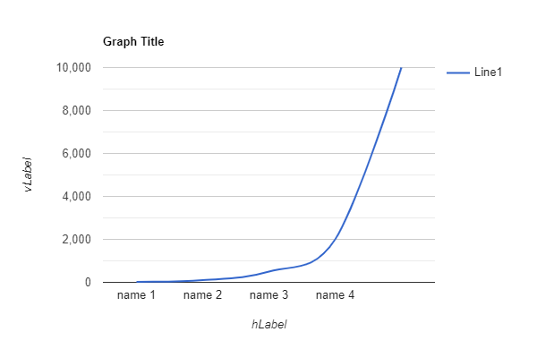

# rewards4dollarsSim
rewards for dollars simulation for e-commerce  
send money,  
example $1000 base price for laptop but u can claim it for $500 in this app,  
the income from ads (then 50% cheaper)  
and the rewards will be like pseudo-progression from rpg  
In this case selected multipliers are 4,5,4,5  
as u see the line  
  
Products: headphones, ssd, laptop, watchguard, antminer  

methods:  addMoney, subtractMoney, debugMultiplier, claimReward, showBalance, promptAmount, mainLogic
